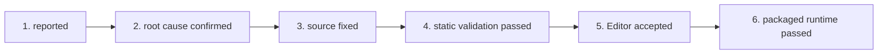

# Testing Feedback and Issue Lifecycle

Use this page to triage bug reports, playtest feedback, and editor warnings.

---

## 6-Stage Issue Lifecycle

Every reported bug or defect must strictly follow this lifecycle:

1. **`reported`**: The issue is recorded in the active ledger (`<project-data>/docs/issues.md`) with reproduction context:
   - Map / mission
   - Player/faction configuration
   - Observed behavior vs expected behavior
   - Exact SC2 Editor warning text or in-game error log (from `<project-data>/runtime/reports/bugreport.txt`)
2. **`root cause confirmed`**: The root catalog ID, parent inheritance flaw, or Galaxy script logic error is identified.
3. **`source fixed`**: Working-tree source files (`Base.SC2Data/GameData/*.xml`, `Base.SC2Data/Scripts/*.galaxy`, etc.) are updated.
4. **`static validation passed`**: `python tools/test-suite.py` executes with zero errors.
5. **`Editor accepted`**: The SC2 Editor opens the modified mod/map cleanly without XML schema warnings, missing dependency errors, or trigger compile failures.
6. **`packaged runtime passed`**: The change is tested and verified in-game.

## Required outcome wording

Every handoff and completion report must name the highest gate actually reached. Use the exact lifecycle label, not ambiguous phrases such as “fully fixed”, “complete”, or “ready” when only static evidence exists.

- A zero-exit pre-flight run authorizes only **`static validation passed`**.
- **`Editor accepted`** requires the person operating the Editor to report a clean reload/compile/save of the affected component source.
- **`packaged runtime passed`** requires recorded in-game reproduction steps and observed results.

`tools/audit-issue-lifecycle.py` enforces valid active-ledger status labels and the evidence fields required by each reached gate.

---

## Issue Intake Rules

- **Statistic Changes:** Before editing XML statistics, record the local catalog entry, parent, inherited value, and intended override in the ledger.
- **UI & Text Fixes:** Identify the exact UI surface (world hover, selection card, command card button, tooltip, or editor text) and its effective localization anchor before modifying `GameStrings.txt` or `ObjectStrings.txt`.
- **Runtime Log Extraction:** Run `python tools/extract-playtest-bugreport.py` after a playtest session to extract `Alerts.txt` and `ScriptError.txt` entries into `<project-data>/runtime/reports/bugreport.txt`.

---

## Ledger Maintenance

Maintain the current issue ledger in `<project-data>/docs/issues.md`. Keep the active ledger concise. Move durable system facts to canonical topic pages rather than retaining long historical discussions in the active ledger.
